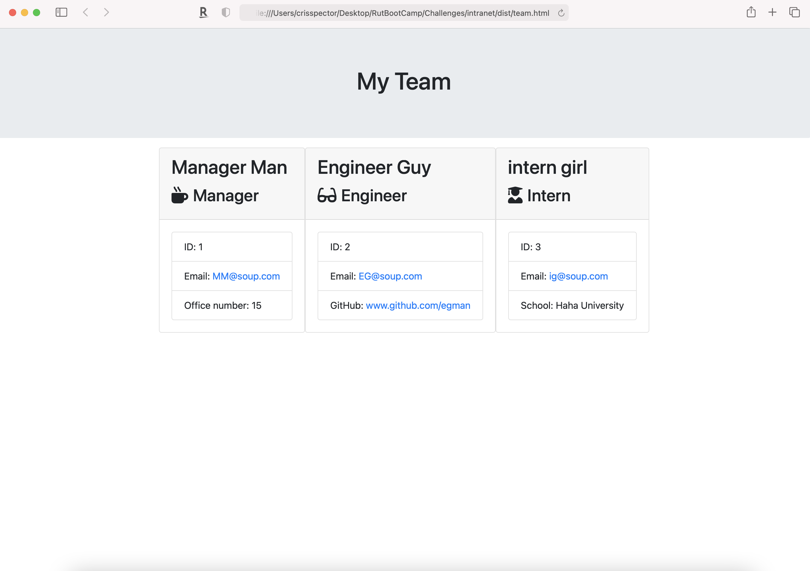

# Intranet
  

  ## Description 
    * build a Node.js command-line application that takes in information about employees on a software engineering team and generates an HTML webpage that displays summaries for each person. 
  ## Table of Contents (Optional)
  
  * [Installation](#installation)
  * [Usage](#usage)
  * [Credits](#credits)
  * [License](#license)

  ## Installation
    * To install: clone the repo, and run "node app", follow prompts.
  
  ## Usage 
    * Use this program by: use it how you want.
     
  
 YouTube Demo: [https://youtu.be/PKIHC4DraU0]
  
  ## Credits
   * The following folks helped with this project: Cris Spector
  
  ## License
   * This project uses this license: https://opensource.org/licenses/MIT
  
  ## Badges
  
  * 
  
  ## Features
    * The project has the following features: HTML, JavaScript, Node
  
  ## Contributing
    * If you'd contribute to this project, consider the following: contribute if you want. 
  ## Tests
    *all tests are built and passing, just run "npm run test" after install.

  ## Questions?
  * Reach out to the repository owner spectocr, https://github.com/spectocr/intranet, or email at highstakes22@gmail.com